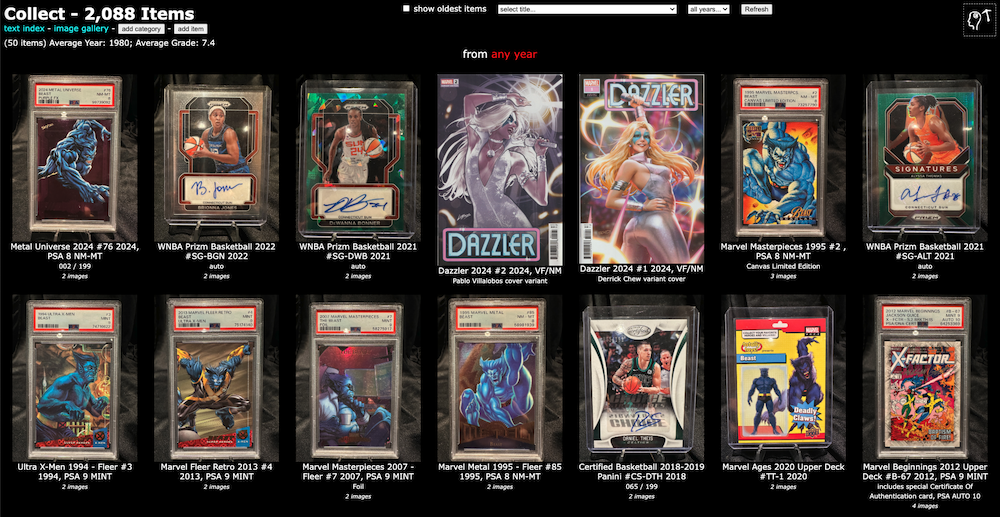

# collect
Web app to catalog collectibles, and a CLI tool to assess item values using AI.

Uses gpt-4 from OpenAI to prompt for market values on comics and magazines.

An example of what a Collect web gallery looked like 1/2025:

